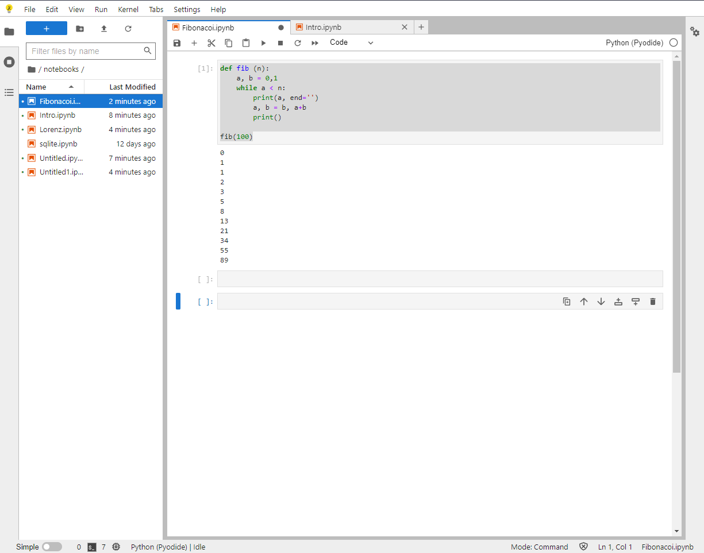

# jupyter
JupyterLab

# H1 JupyterLab 

**JupyterLab es una interfaz de usuario basada en web para Júpiter del proyecto y está estrechamente integrado en Adobe Experience Platform. Proporciona un entorno de desarrollo interactivo para que los científicos de datos trabajen con Jupyter Notebooks, código y datos.JupyterLab es una interfaz de usuario basada en web para Júpiter del proyecto y está estrechamente integrado en Adobe Experience Platform. Proporciona un entorno de desarrollo interactivo para que los científicos de datos trabajen con Jupyter Notebooks, código y datos.**

# H1 Ejemplo

